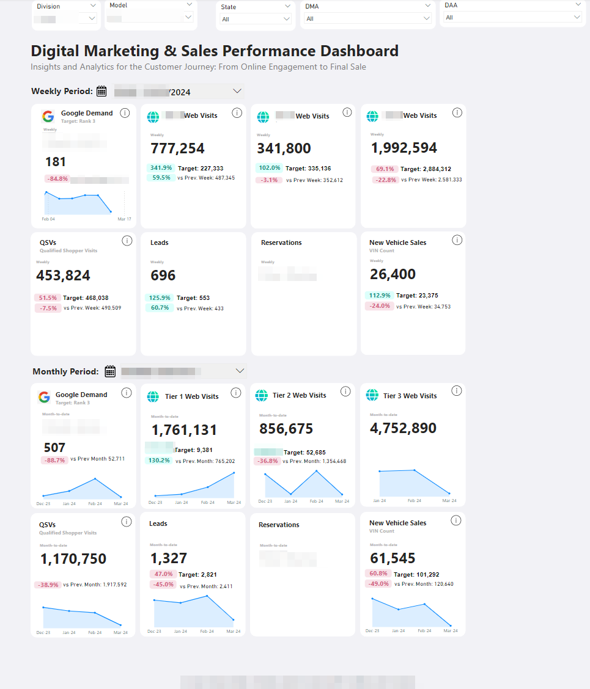

<!-- PROJECT LOGO -->
 

  

<h3 align="center">Digital Marketing Dashboard</h3>

  

The Digital Marketing Dashboard is a comprehensive Power BI project that provides an in-depth overview of key digital marketing metrics related to vehicle sales. It offers insights into web visits, qualified shopping visits, Google demand comparisons, leads, reservations, new vehicle sales, and performance summaries, enabling stakeholders to make informed strategic decisions and optimize marketing efforts.

  

<!-- TABLE OF CONTENTS -->

  
Table of Contents

  <ol>
    <li><a href="#about-the-project">About the Project</a></li>
    <li><a href="#built-with">Built With</a></li>
    <li><a href="#screenshots">Screenshots</a></li>
    <li><a href="#contact">Contact</a></li>
  </ol>

<!-- ABOUT THE PROJECT -->
## About The Project

<!-- [![Product Name Screen Shot][product-screenshot]](https://example.com) -->

This dashboard leverages advanced data visualization and analysis tools to track and analyze vehicle sales performance, web traffic from different tiers, and qualified shopping visits. It also compares vehicle demand against competitors using Google data, and manages leads and reservations to provide a complete picture of new vehicle sales. The project integrates data from Oracle Data Warehouse, Treasure Data Customer Data Platform, Adobe Analytics, Google BigQuery, and Salesforce, ensuring comprehensive and accurate insights for digital marketing optimization.

(<a href="#top">back to top</a>)

### Built With
###### Data Sources and Tools
* **Power BI**: The main tool for data visualization and dashboard creation, offering advanced features for interactive and real-time analysis.
* **Oracle Data Warehouse**: Utilized for storing and processing large datasets, providing robust data warehousing capabilities.
* **Customer Data Platform (Treasure Data)**: Employed for managing and analyzing customer data to gain deeper insights.
* **Adobe Analytics**: Used for tracking and analyzing web visit data, offering detailed insights into user behavior.
* **Google Demand (BigQuery)**: Leveraged for comparing vehicle demand among competitors using Google's data.
* **Salesforce**: Used for managing leads data, enabling efficient tracking and analysis of lead generation efforts.

<!-- 
* [React.js](https://reactjs.org/)
* [Vue.js](https://vuejs.org/)
* [Angular](https://angular.io/)
* [Svelte](https://svelte.dev/)
* [Laravel](https://laravel.com)
* [Bootstrap](https://getbootstrap.com)
* [JQuery](https://jquery.com) -->

(<a href="#top">back to top</a>)

<!-- SCREENSHOTS -->
## Screenshots

**Digital Marketing Dashboard Overview**: A snapshot of the dashboard showcasing individual KPI cards for each metric.
- **Vehicle Sales Overview**: Tracks and analyzes vehicle sales performance.
- **Web Visits Analysis**: Monitors web visits segmented by three different tiers.
- **Qualified Shopping Visits**: Measures the number of qualified shopping visits to the website.
- **Google Demand Analysis**: Compares vehicle demand against competitors using data from Google.
- **Lead Management**: Tracks leads generated through various marketing channels.
- **Reservation and Sales Tracking**: Monitors reservations and new vehicle sales.
- **Performance Summaries**: Provides detailed weekly and monthly overviews to gauge growth and sustainability.

(<a href="#top">back to top</a>)

<!-- Image Stack with GitHub Links -->

<!-- Image with GitHub Link -->
<b>Digital Marketing Overview Page</b>

  

(<a href="#top">back to top</a>)

<!-- CONTACT -->
## Contact

Portfolio Link: [https://shainalolin.com](https://shainalolin.com)

(<a href="#top">back to top</a>)

<!-- MARKDOWN LINKS & IMAGES -->
<!-- https://www.markdownguide.org/basic-syntax/#reference-style-links -->
[contributors-shield]: https://img.shields.io/github/contributors/github_username/repo_name.svg?style=for-the-badge
[contributors-url]: https://github.com/github_username/repo_name/graphs/contributors
[forks-shield]: https://img.shields.io/github/forks/github_username/repo_name.svg?style=for-the-badge
[forks-url]: https://github.com/github_username/repo_name/network/members
[stars-shield]: https://img.shields.io/github/stars/github_username/repo_name.svg?style=for-the-badge
[stars-url]: https://github.com/github_username/repo_name/stargazers
[issues-shield]: https://img.shields.io/github/issues/github_username/repo_name.svg?style=for-the-badge
[issues-url]: https://github.com/github_username/repo_name/issues
[license-shield]: https://img.shields.io/github/license/github_username/repo_name.svg?style=for-the-badge
[license-url]: https://github.com/github_username/repo_name/blob/master/LICENSE.txt
[linkedin-shield]: https://img.shields.io/badge/-LinkedIn-black.svg?style=for-the-badge&logo=linkedin&colorB=555
[linkedin-url]: https://linkedin.com/in/linkedin_username
[product-screenshot]: images/screenshot.png
[s1-screenshot]: images/Saffron-Autos-01.png
